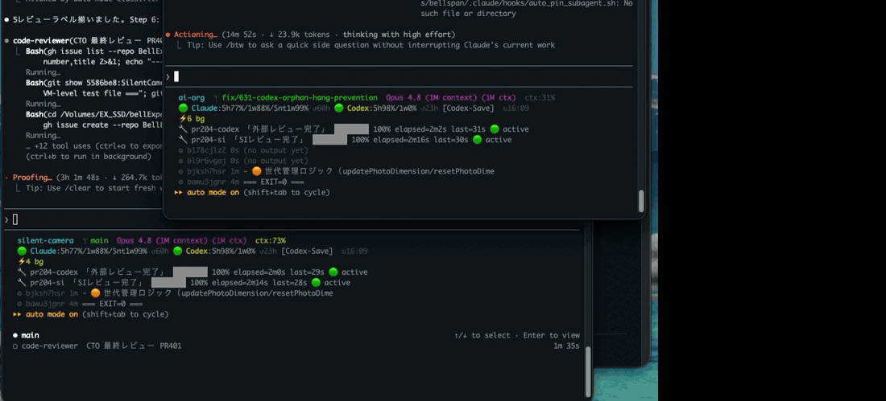

# ai-usage-monitor

> **macOS 専用** — `date -v` / `date -r`（BSD date）・`id -u` 形式・launchd を使用しており、Linux / Windows では動作しません。

**Claude Code と Codex（OpenAI）のサブスクリプション使用量をリアルタイムに可視化し、残量に応じて「どちらに仕事を振るか（ルーティング）」を自動提案する macOS 常駐ツール。**

Claude Code の **statusLine**（ターミナル最下部のステータス行）と **SwiftBar**（メニューバー）に、5h・週次の残量％、トークン数・コスト、そして実行中のバックグラウンドジョブの進捗を常時表示する。



> **整形済みの全文ドキュメント（Web 版）: <https://bellexpan.github.io/ai-usage-monitor/>**
> （API Doc 風・左サイドバー TOC 付き。ローカルでは `docs/index.html` をブラウザで開いても同じものが見られます）

```
ai-org  ᛘ main  Sonnet 4.6 (200k ctx)  ctx:32%
🟢 Claude:5h89%/1w90%/Snt1w86%  🟢 Codex:5h99%/1w99% [Balanced +2%]  ↻12:05
⚡3 bg  ⏳ CI 3/5 passing
🔧 ri-pr42 「RI レビュー」 ████░░░░ 50% elapsed=12s last=3s 🟢 active
   ⚙ bui49k40l 8s  npm test passing 12/30 ...
```

---

## なぜ作ったか

Claude Code（Max プラン）と Codex（Plus プラン）を併用していると、次の課題が日常的に起きる。

- **使用量が見えない。** 「今このタスクを重い Claude に投げて 5h 枠を使い切って大丈夫か？」が判断できない。Web の管理画面を毎回見に行くのは現実的でない。
- **どちらに振るべきか分からない。** Claude が枯渇気味なら調査・要約は Codex に回したい。だが残量を把握していないと判断できず、結局「止まってから気づく」。
- **バックグラウンドの仕事が見えない。** subagent やビルド・テストを並列で走らせると、「動いているのか・スタックしているのか」が分からない。

このツールは **「残量」と「進行中の仕事」を常に視界に入れる**ことで、これらを解決する。判断のための情報を、判断する場所（ターミナル）に置く。

---

## 主な機能

| 機能 | 説明 |
|---|---|
| **使用量の常時表示** | Claude（5h / 週次全モデル / 週次 Sonnet）と Codex（5h / 週次）の残量％を statusLine・メニューバーに表示 |
| **ルーティング自動提案** | 残量に応じて `Balanced` / `Codex-First` / `Claude-First` / `Codex-Save` / `Save-Claude` 等のモードを算出し、「今はどちらに振るべきか」を示す |
| **バックグラウンド進捗** | 実行中の subagent / bash ジョブを **1タスク1行**で表示。進捗バー・経過時間・スタック検知・作業内容スニペット付き |
| **任意ジョブの進捗注入** | `bg-status.sh` で CI/E2E/ビルド等の進捗を statusLine に流せる（job 別・複数同時） |
| **コスト・トークン可視化** | ccusage 連携で 7日 / 当日のトークン数・コストを表示（SwiftBar） |
| **アイドル中も更新** | `refreshInterval` 対応で、バックグラウンドジョブ待ちの間も statusLine が定期更新される |

---

## アーキテクチャ

「データ収集」と「表示」を分離し、収集は 5 分ごとに launchd が **キャッシュファイル**へ書き、各表示先はキャッシュを読むだけにしている。表示のたびに API を叩かないので軽量で、API quota も消費しない。

```
 データソース                       収集 (launchd・5分毎)            表示
 ───────────────────────           ───────────────────            ──────────────────────────
 Anthropic OAuth API  ──┐
 /api/oauth/usage       │
 (5h / 週次 残量%)       │
                        ├──→  cache-update.sh  ──→  cache  ──┬──→  statusline.sh   (Claude Code)
 ccusage (ローカル JSONL)│       (5分ごとに更新)    (KV file)  ├──→  ai_usage.5m.sh  (SwiftBar)
 (トークン/コスト)        │                                    └──→  session-start.sh(SessionStart hook)
                        │
 ~/.codex/sessions/**   │
 *.jsonl の rate_limits ─┘

 ＜バックグラウンド進捗の別系統＞
 subagent / bash job ──→ ai-org-progress / bg-status.sh ──→ 状態ファイル ──→ statusline.sh の 🔧/⏳/⚙ 行
```

- **収集 (`cache-update.sh`)**: launchd が 5 分ごとに起動。OAuth API・ccusage・Codex セッション JSONL を読み、`$DARWIN_USER_TEMP_DIR/ai-usage-monitor/cache` に `KEY=VALUE` で書く。
- **表示**: statusLine / SwiftBar / SessionStart hook はキャッシュを `source` して読むだけ（高速・API 非依存）。
- **進捗は別系統**: バックグラウンド進捗は `/tmp/ai-org-progress/`（subagent 用）と `~/.claude/bg_status/`（任意ジョブ用）の状態ファイルを statusLine が直接読む。こちらはリアルタイム。

---

## 表示の詳細

### 1. Claude Code statusLine（複数行）

```
ai-org  ᛘ main  Sonnet 4.6 (200k ctx)  ctx:32%
🟢 Claude:5h89%/1w90%/Snt1w86%  🟢 Codex:5h99%/1w99% [Balanced +2%]  ↻12:05
⚡3 bg  ⏳ CI 3/5 passing
🔧 ri-pr42 「RI レビュー」 ████░░░░ 50% elapsed=12s last=3s 🟢 active
   ⚙ bui49k40l 8s  npm test passing 12/30 ...
```

| 表示 | 意味 |
|---|---|
| `ai-org ᛘ main` | リポジトリ名・現在のブランチ |
| `Sonnet 4.6 (200k ctx)` | 使用中のモデルとコンテキストウィンドウサイズ |
| `ctx:32%` | コンテキスト使用率（50%+ 黄 / 80%+ 赤 / 100%+ dim） |
| `🟢 Claude:5h89%/1w90%/Snt1w86%` | Claude 5h残 / 週次全モデル残 / 週次 Sonnet残（🟢≥30% 🟡<30% 🔴<10%） |
| `🟢 Codex:5h99%/1w99%` | Codex 5h残 / 週次残（🟢≥50% 🟡<50% 🔴<20%） |
| `[Balanced +2%]` | ルーティングモードとバランスギャップ |
| `↻12:05` | キャッシュ最終更新時刻 |
| `⚡N bg` | バックグラウンドタスク数（= 以下の行数と一致） |
| `⏳ <msg> · <msg>` | `bg-status.sh` で流した任意ジョブの進捗（新鮮な間だけ集約表示） |
| `🔧 <id>「ラベル」<バー> %` | 進捗報告ジョブ（subagent / ai-org-progress）を 1 行ずつ |
| `⚙ <id> <経過> <出力>` | 進捗を持たない bash background を 1 行ずつ（最新出力行をスニペット表示） |

### 2. SwiftBar メニューバー

```
🟢 Claude 89%/週90%/Sonnet86% | 🟢 Codex 99%/週99%
```

クリックでドロップダウン:

```
Claude (Max 20x)
  セッション(5h)  残89% (11%使用)
  週次 全モデル   残90% (10%使用)
  週次 Sonnetのみ 残86% (14%使用)
  7d    2.1G tokens / $0.00
──────────────────────────────
Codex (Plus)
  5h窓  🟢 残り 99% リセット: 14:30
  週次  🟢 残り 99% リセット: 05/19
──────────────────────────────
🟢 [Balanced]
──────────────────────────────
最終更新: 12:05
今すぐ更新
```

### 3. SessionStart フック

セッション開始時に使用量サマリとルーティング指針を表示する。

```
[AI使用量司令塔] 🟢 [Balanced]
Claude 5h:残89% 週:残90% Sonnet週:残86%
Codex 5h:残99% 週:残99%
```

---

## statusLine の仕組み（Claude Code 連携）

Claude Code の statusLine は「**任意のシェルスクリプトを実行し、その標準出力を最下部に表示する**」機能。スクリプトには stdin で JSON（モデル名・コンテキスト使用率・workspace パス等）が渡る。

- **複数行対応**: スクリプトが複数行を出力すると、各行がそのまま行として表示される。本ツールはこれを利用して「bg タスクを 1 タスク 1 行」で見せている。
- **更新タイミング**: 標準ではイベント駆動（アシスタントの新メッセージ後・300ms デバウンス）。**バックグラウンドジョブ待ちでアイドルになると更新が止まる**ため、`refreshInterval`（秒・最小 1）を設定して定期更新させる。
- **キーは camelCase**: `"statusLine"`。`"statusline"`（小文字）では読まれない。

```json
// ~/.claude/settings.json
"statusLine": {
  "type": "command",
  "command": "/path/to/ai-usage-monitor/scripts/statusline.sh",
  "refreshInterval": 2,
  "padding": 1
}
```

---

## バックグラウンドジョブ進捗の注入（`bg-status.sh`）

長時間のバックグラウンドジョブ（CI/E2E 監視・ビルド・テスト）から進捗を statusLine に流せる。**job ごとに key を付けて複数同時表示**できる。

```bash
scripts/bg-status.sh set ci  "CI 3/5 passing"   # job key = ci
scripts/bg-status.sh set e2e "E2E 2/4"          # job key = e2e
# → statusLine に「⏳ CI 3/5 passing · E2E 2/4」

scripts/bg-status.sh set "building app"          # key 省略 = default key（後方互換）
scripts/bg-status.sh clear ci                    # ci job のみ消す
scripts/bg-status.sh clear                       # 全 job を消す
```

| 特性 | 内容 |
|---|---|
| **job 別・複数同時** | key ごとに別ファイルで管理するため、複数ジョブが同時に書いても競合しない |
| **プロジェクトスコープ** | cwd の git リポジトリルートごとに分かれ、別リポジトリのセッションに進捗が漏れない |
| **自動失効** | `CLAUDE_BG_STATUS_FRESH_SECS`（既定 600 秒）超の進捗は自動で非表示・ファイルも reap |
| **安全** | 表示時に ANSI エスケープ・制御文字を除去（statusLine への注入・表示崩れを防止）。key はファイル名にサニタイズされパストラバーサル不可 |
| **atomic 書き込み** | `mktemp` → `mv` で、statusLine が読む瞬間の空・部分表示を防ぐ |

環境変数: `CLAUDE_BG_STATUS_DIR`（基底ディレクトリ）/ `CLAUDE_BG_STATUS_FRESH_SECS`（新鮮判定秒）/ `CLAUDE_BG_STATUS_MAX_JOBS`（同時表示上限・既定 3・超過は `+N`）/ `CLAUDE_BG_STATUS_MAX_CHARS`（表示最大文字数・既定 200）。

---

## 進捗の数字はどう作っているか（と、その限界）

statusLine の `60%` や `████░░░░`、`1/3` といった進捗は **自動計測ではなく、呼び出し側（エージェント）の自己申告**で成り立っている。設計上の割り切りと限界を明記しておく。

### 数字の出どころ

```bash
ai-org-progress write <id> <current> <total> "<label>"
```

`current`（今いくつ）と `total`（全部でいくつ）を**呼び出し側が渡す**。subagent を dispatch する際、プロンプトに「進捗 pin」を埋め込み、マイルストーン到達時にエージェント自身が書き込む（`enforce_subagent_progress` フックが pin 無し dispatch を弾く）。

```bash
ai-org-progress write ri-pr48 1 3 "差分読み込み"
ai-org-progress write ri-pr48 2 3 "レビュー投稿"
ai-org-progress write ri-pr48 3 3 "判定"
```

表示される数字はこの JSON（`{current,total,label,started,updated,parent,completed,pid?,agent_file?}`）と時刻から算出する。

| 表示 | 計算 |
|---|---|
| `60%` | `current / total × 100` |
| `████░░░░` | `current / total × 幅` ブロック |
| `elapsed=2s` | `now − started` |
| `last=2s` | `now − updated`（最後の write からの経過） |
| `✅ done` | `completed=true` または `current ≥ total`（完了は stuck 表示しない） |
| `🟢 running` | anchor（`pid`/`agent_file`）が**生存**（更新が古くても stuck にしない＝長時間タスク許容） |
| `❌ ended` | anchor が**死亡確定**（`pid` 消滅 / `agent_file` mtime が古い）→ reap 対象 |
| `🟢 active` / `⚠️ stuck?` | anchor なし時のみ `now − updated` の 90 秒で判定 |
| 親（root）の集約値 | 子孫の `current/total` を合算 |

#### 死活判定（liveness healthcheck — Issue #645）

旧実装は `now − updated`（最後の進捗書き込みからの経過）だけで `stuck?` を出していたため、
**死んだ pin が 24 時間残る**・**生きている長時間タスクも誤って stuck 判定される**問題があった。

現在は pin に **anchor** を持たせて実際の死活を判定する:

- `pid`: `kill -0` でプロセス生死を確定判定
- `agent_file`: subagent の jsonl の mtime が `LIVENESS_FRESH_SEC`（既定 120s）以内なら生存
- anchor は subagent dispatch 時に `auto-pin-subagent.sh` hook が自動付与（`agentId` → jsonl パス解決）

そして **`ai-org-progress reap`** が `subagent-watch`（launchd 10s 周期）から定期実行され:

- anchor が死亡確定 → 即 reap（clear）
- anchor なしで `ORPHAN_HIDE_SEC`（既定 1800s=30分）超の `completed=false` pin → 孤児とみなし reap
- 生存中の長時間タスク（anchor 生存）は温存

これにより「死んだものは残さない／生きている長時間タスクはそのまま」を構造的に保証する。

> **このツール群（`ai-org-progress.sh` / `ai-org-subagent-watch.sh` / `enforce-subagent-progress.sh` / `auto-pin-subagent.sh`）は Issue #645 で ai-org から本 repo へ移管された。`scripts/setup.sh` が `~/.local/bin` と `~/.claude/hooks/` へ install する。**

つまり数字の正体は「**エージェントが宣言したステップ番号**（self-reported milestone）」であり、実作業量を測ったものではない。

### 進捗を「数字」にしにくいタスク

`current/total` で表しにくいタスクは確実にある。

| 類型 | 例 | なぜ % が嘘になるか |
|---|---|---|
| 探索・調査 | バグ原因特定・コード探索 | 終わるまで「あと何ステップか」が分からず total を決められない |
| 長い単一処理 | `xcodebuild` / ffmpeg / 大きな test run | 中身が 1 ステップで `0/1 → 1/1` しか刻めない |
| 待ち | CI 完了待ち・deploy 待ち | 進捗が線形でない |
| 品質・創作 | コピーを書く・設計を練る | 自然な単位がない |

これらを無理に milestone 化すると `total=2`「読込/判定」のように**恣意的**になり、% は実態を測らなくなる。

### なので「% に固執しない」2 モードを用意している

**(1) indeterminate（不定）モード** — `total=0` で書くと % を出さず `cur/?` 表示になる。数を諦めて**ラベルを heartbeat 更新**する。

```bash
ai-org-progress write dbg 0 0 "原因調査中: AVAudioSession 周辺"
ai-org-progress write dbg 0 0 "原因特定: setActive の順序"
```

→ 数字の代わりに `last=Xs`（最終更新からの経過）と `🟢 active / ⚠️ stuck?`（生死）が「ちゃんと動いている」を伝える。

**(2) output-tail モード（`⚙` 行）** — `run_in_background` の長い処理は % を出さず、`.output` の**最新行をそのままスニペット表示**する。ログ自体が進捗を語るタスク（ビルド・テスト・ダウンロード）はこれが最も正直。

```
⚙ b8a8262ps 0s  ビルド中: モジュール 6/8 をコンパイル...
```

### 設計方針

> **多くのタスクで「%」は間違った抽象。**「今なにをしているか（label / ログ末尾）」＋「生きているか（last / stuck）」の方が、嘘がなく実用的。

milestone % が向くのは「ステップ数が事前に確定できる定型タスク」（PR レビューの RI→SI→BCI→… 等）だけ。それ以外は indeterminate か output-tail に倒すのが正解。

### 残る穴（正直に）

長い単一処理が**無申告・無出力**だと、90 秒で `⚠️ stuck?` の**誤判定**が出る（本当は動いている）。回避策は「定期 heartbeat を書く」か「`run_in_background` で走らせてログ末尾を `⚙` で見せる」。完全自動の「真の進捗推定」は持っていない（原理的に持てない領域）。

---

## ルーティングモード

残量から「どちらに振るべきか」を `cache-update.sh` が自動算出する（`statusline.sh` がラベル表示）。判定の核は **バランスギャップ**（`Claude週次残% − Codex週次残%`）だが、その手前に **Claude 保護**・**Codex 保護**・**Burn（使い切れない余剰の積極消費）** が優先される。下表は**上から優先**で評価される。

| モード | ラベル | 条件（上から優先評価） | 指針 |
|---|---|---|---|
| `claude_critical` | 🚨 `[Claude-Critical]` | Claude 週次残 < 危機閾値 | 緊急。全力で Codex へ逃がす |
| `save_claude` | ⚠️ `[Save-Claude]` | Claude 週次残 < 温存閾値 | Codex 最大活用で Claude を温存 |
| `protect_codex` | `[Codex-Save]` | Codex 5h残 < 20% または 週次残 < 動的閾値 | Codex 枯渇 → Claude を維持 |
| `codex_burn` | 🔥 `[Burn-Codex]` | Codex にリセットまで使い切れない余剰、Claude は余剰なし | Codex を積極消費 |
| `claude_burn` | 🔥 `[Burn-Claude]` | Claude に余剰、Codex は余剰なし | Claude を積極消費 |
| `codex_first` | `[Codex-First +N%]` | ギャップ > +10%（Claude の方が余裕） | 調査・レビューは Codex へ |
| `claude_first` | `[Claude-First +N%]` | ギャップ < −10%（Codex の方が余裕） | Claude 優先 |
| `normal` | `[Balanced +N%]` | ギャップ ±10% 以内 | バランス（タスク種別で振る） |

**動的閾値**: Claude 保護閾値（危機/温存）は **リセットまでの残り時間でスケール**する（`threshold = base × hours_until_reset / 168`、危機 base=5% / 温存 base=15%）。リセット直前なら多少残量が少なくても問題なし、リセットが遠いほど厳しく保護する。Codex の週次閾値もリセットまで 24h/48h/それ以上で 3% / 5% / 10% と動的。

**Burn 検出**: `残量% − (リセットまで時間 × 推定消費 20%/day)` がリセット後も 25% 以上残る見込みなら「使い切れない余剰」と判断し、その枠を積極消費するモードに倒す。

> `+N%` はバランスギャップ（`statusline` の `[Balanced +2%]` 等）。Codex データが stale/取得失敗のときはギャップ 0 扱いで誤ルーティングを防ぐ。

---

## セットアップ

```bash
git clone https://github.com/BellExpan/ai-usage-monitor.git
cd ai-usage-monitor
bash scripts/setup.sh
```

`setup.sh` が自動でやること:

1. スクリプトへの実行権限付与
2. launchd 登録（5 分ごとにキャッシュ更新）
3. SwiftBar プラグインのシンボリックリンク作成
4. Claude Code の SessionStart フックへの登録
5. 旧バージョンキャッシュ（`/tmp/.ai_usage_*`）の削除・移行
6. 既存キャッシュファイルの権限ドリフト修復（644→600）
7. 初回キャッシュの即時生成

### 手動で必要な設定（statusLine）

statusLine だけは `~/.claude/settings.json` への手動追記が必要（理由は次節）。

```json
"statusLine": {
  "type": "command",
  "command": "/path/to/ai-usage-monitor/scripts/statusline.sh",
  "refreshInterval": 2,
  "padding": 1
}
```

---

## なぜ Claude Code Plugin にしなかったか（設計上の判断）

> このツールは社内（業務委託先）への **Claude Code Plugin としての配布**を検討したが、公式仕様を調査した結果「**フル Plugin 化は不可能・companion plugin に留まる**」と結論した。LT 用の学びとして記録する。

### Claude Code Plugin がバンドルできるもの

`skills/` `commands/` `agents/` `hooks/`（hooks.json）`.mcp.json` `.lsp.json` `monitors/`（monitors.json = tail 型の常駐通知）`bin/`（PATH に載る実行ファイル）`settings.json`（**`agent` と `subagentStatusLine` キーのみ**）。

### 致命的な制約

| 本ツールの構成要素 | Plugin 化 | 理由 |
|---|---|---|
| **statusline.sh（メイン statusLine）** | ❌ **不可** | Plugin の settings.json は**メインの `statusLine` キーを未サポート**（`agent` / `subagentStatusLine` のみ）。**最大の価値である statusLine を plugin で自動設定できない**。ユーザーが手動で settings.json に書くしかない |
| launchd（5 分ごとのキャッシュ更新） | ❌ 不可（外部） | Plugin の monitors は「stdout を Claude への通知に流す tail 型」。定期 silent 更新には不向き。常駐は launchd 管轄 |
| SwiftBar メニューバー | ❌ 不可（外部） | Claude Code の管轄外 |
| SessionStart フック | ✅ 可 | `hooks/hooks.json` でバンドル可 |
| `bg-status.sh` / 進捗 CLI | ✅ 可 | `bin/` に置けば PATH に載る |

### 結論：companion plugin が限界

最大価値の statusLine・launchd・SwiftBar が plugin で完結しないため、**「plugin を入れれば完成する」体験は作れない**。作れるのはせいぜい「**Claude Code から入れる導線（companion）**」止まり:

- `bin/`（進捗 CLI）+ opt-in の SessionStart hook + `/setup` `/doctor` skill
- `monitors/` は「使用量 80%/95% 超過・OAuth 失敗・cache stale」など**重要イベントだけ**（5 分ごとの使用量を流すと会話ノイズになる）
- statusLine の設定は plugin install 時の自動ではなく、**setup skill がユーザー明示実行で settings.json を構造的に編集**（バックアップ・既存検出・idempotent が必須）
- ⚠️ `statusLine.command` に **plugin install ディレクトリを直書きしてはいけない**（更新でパスが変わる）。`~/.claude/ai-usage-monitor/statusline.sh` 等の安定パスを指す

→ 利用者が少ない段階では **standalone（`setup.sh`）で磨く方が効率的**。配布価値が出てきたら companion plugin を追加する、という判断にした。

> **学び**: Claude Code Plugin は「skills / agents / hooks / MCP を共有する」のが本質で、**statusLine・常駐プロセス・メニューバーのような “環境常駐型ツール” の配布手段ではない**。ツールの価値の所在（= statusLine）と、plugin が配布できる範囲が噛み合うかを最初に確認すべきだった。

---

## データソース

| データ | ソース | 更新頻度 |
|---|---|---|
| Claude 5h / 週次全モデル / 週次Sonnet（%） | Anthropic OAuth API `/api/oauth/usage` | 5分ごと（launchd） |
| Claude トークン数・コスト（7d / 24h） | ccusage（ローカル JSONL） | 5分ごと |
| Codex 5h / 週次（%・リセット時刻） | `~/.codex/sessions/**/*.jsonl` の `rate_limits` | 5分ごと |
| Codex トークン数・コスト | @ccusage/codex（ローカル JSONL） | 5分ごと |

### OAuth API アクセス方法

Claude Code がキーチェーンに保存したトークンを利用（追加設定不要）:

```bash
security find-generic-password -s "Claude Code-credentials" -w
# → {"claudeAiOauth": {"accessToken": "...", ...}}
```

```
GET https://api.anthropic.com/api/oauth/usage
Authorization: Bearer <accessToken>
anthropic-beta: oauth-2025-04-20
```

---

## 前提条件

- macOS
- Claude Code（`security find-generic-password` でキーチェーンからトークン取得）
- [SwiftBar](https://swiftbar.app)（`brew install --cask swiftbar`）— メニューバー表示が不要なら任意
- Node.js（`npx` が使えること）
- [ccusage](https://github.com/ryoppippi/ccusage) / [@ccusage/codex](https://github.com/ryoppippi/ccusage)（`npx` 経由で自動取得）

---

## セキュリティ

キャッシュディレクトリ（`$DARWIN_USER_TEMP_DIR/ai-usage-monitor/`）は以下の保護が施されている。

| 対策 | 実装 |
|---|---|
| **Squatting 防止** | `[ -O "$AI_USAGE_DIR" ]` — 自分所有でなければ拒否 |
| **Symlink 攻撃防止** | `[ -L "$AI_USAGE_DIR" ]` — シンボリックリンクなら拒否 |
| **キャッシュファイル権限** | `chmod 600` — 他ユーザーから読めない |
| **ロックディレクトリ競合** | `mkdir` アトミック操作 + PID ファイルで二重起動防止 |
| **相対パス traversal** | `AI_USAGE_BASE_DIR` に相対パスを渡すと警告後デフォルトにフォールバック |
| **statusLine への注入防止** | bg 進捗・出力スニペットは表示前に ANSI エスケープ・制御文字・バックスラッシュを除去 |

### `AI_USAGE_BASE_DIR` 環境変数

テスト・スクリプト開発時にキャッシュ基底ディレクトリをオーバーライドできる（必ず絶対パス。相対パスは警告してデフォルトにフォールバック）。

```bash
export AI_USAGE_BASE_DIR=/tmp/test-sandbox
bash scripts/cache-update.sh
```

---

## テスト

```bash
brew install bats-core   # 未インストールの場合

bats tests/session-start-lock.bats
bats tests/statusline-bg-status.bats
```

- `session-start-lock.bats`（13件）: ロック競合・stale PID 判定・キャッシュパス・`init_cache_dir` セキュリティチェック
- `statusline-bg-status.bats`（27件）: bg-status の set/clear/render・複数 job 集約・MAX_JOBS 上限・stale/future ガード・ANSI 注入除去・パストラバーサル/dotfile サニタイズ・レガシー単一ファイル互換・CLI

全テストは `AI_USAGE_BASE_DIR` / 隔離 PROGRESS_DIR のサンドボックスで動作し、本番キャッシュには触れない。

---

## ファイル構成

```
ai-usage-monitor/
├── scripts/
│   ├── lib/
│   │   ├── cache-path.sh  # キャッシュパス正典（AI_USAGE_DIR / CACHE_FILE / LOCK_DIR / init_cache_dir）
│   │   ├── bg-status.sh   # バックグラウンド進捗の状態関数（set/clear/render）
│   │   └── parse_codex_rate_limits.py  # Codex rate_limits パーサ（null マーカー skip・5h/週枠の残量と resets_at 抽出）
│   ├── cache-update.sh    # キャッシュを5分ごと更新（launchd から呼ばれる）
│   ├── statusline.sh      # Claude Code statusline（stdin JSON + キャッシュ）
│   ├── bg-status.sh       # バックグラウンド進捗 set/clear CLI（⏳ 表示）
│   └── setup.sh           # ワンコマンドセットアップ
├── swiftbar/
│   └── ai_usage.5m.sh     # SwiftBar プラグイン（5分ごと自動リフレッシュ）
├── hooks/
│   └── session-start.sh   # Claude Code SessionStart フック
├── tests/
│   ├── session-start-lock.bats     # ロック・キャッシュパスの bats テスト（13件）
│   ├── statusline-bg-status.bats   # バックグラウンド進捗の bats テスト（27件）
│   └── codex-rate-limits-parser.bats  # Codex rate_limits パーサの bats テスト（8件）
└── launchd/
    └── com.aiorg.usage-monitor.plist  # launchd ジョブ定義
```

---

## キャッシュファイル仕様

`$DARWIN_USER_TEMP_DIR/ai-usage-monitor/cache`（`KEY=VALUE` 形式、`source` して使用）

| キー | 内容 |
|---|---|
| `CLA_OAUTH_FRESH` | OAuth API からの取得成功フラグ（1=成功） |
| `CLA_5H_USED_PCT` / `CLA_5H_REMAINING_PCT` | Claude セッション(5h) 使用%・残% |
| `CLA_7D_USED_PCT` / `CLA_7D_REMAINING_PCT` | Claude 週次全モデル 使用%・残% |
| `CLA_7D_SONNET_USED_PCT` / `CLA_7D_SONNET_REMAINING_PCT` | Claude 週次Sonnet 使用%・残% |
| `CLA_5H_RESETS_AT` / `CLA_7D_RESETS_AT` | リセット時刻（Unix epoch） |
| `CLA_5H_TOKENS` | Claude 現在ブロックのトークン数 |
| `CLA_7D_TOKENS` / `CLA_7D_COST` | Claude 7日間トークン数・コスト |
| `CLA_24H_TOKENS` / `CLA_24H_COST` | Claude 当日トークン数・コスト |
| `CDX_5H_USED_PCT` / `CDX_5H_REMAINING_PCT` | Codex 5h 使用%・残% |
| `CDX_WEEK_USED_PCT` / `CDX_WEEK_REMAINING_PCT` | Codex 週次 使用%・残% |
| `CDX_5H_RESETS_AT` / `CDX_WEEK_RESETS_AT` | Codex リセット時刻（Unix epoch） |
| `CDX_RATE_LIMITS_FRESH` | Codex データが24h以内か（1=新鮮） |
| `CDX_WEEK_TOKENS` / `CDX_WEEK_COST` | Codex 週次トークン数・コスト |
| `CDX_24H_TOKENS` / `CDX_24H_COST` | Codex 当日トークン数・コスト |
| `ROUTING_MODE` | `claude_critical` / `save_claude` / `protect_codex` / `codex_burn` / `claude_burn` / `codex_first` / `claude_first` / `normal` の 8 値 |
| `CDX_UNDERUSE_WARN` | Codex未活用警告フラグ（1=未活用 / 0=正常） |
| `TIMESTAMP` | キャッシュ生成時刻（Unix epoch） |

---

## トラブルシューティング

| 症状 | 原因・対処 |
|---|---|
| statusLine に何も出ない | `~/.claude/settings.json` の `statusLine` が未設定、またはキーが小文字 `statusline`。camelCase `statusLine` で記述 |
| `⚠cache stale` が出続ける（旧版） | launchd が動いていない。`launchctl list \| grep usage-monitor` で確認、`bash scripts/cache-update.sh` を手動実行 |
| アイドル中に進捗が固まる | `refreshInterval` 未設定。settings.json に `"refreshInterval": 2` を追加 |
| `⏳` が出ない | `bg-status.sh` を実行した cwd と statusLine の cwd（= ワークスペース）が別プロジェクト。同じリポジトリ内で実行する |
| 数値が `100%` 固定 | OAuth トークン取得失敗（キーチェーン未認証）。Claude Code に再ログイン |

---

## なぜ macOS 専用か

`date -v` / `date -r`（BSD date 構文）、`$DARWIN_USER_TEMP_DIR`、`stat -f`、launchd、SwiftBar、キーチェーン（`security`）に依存しているため。Linux/Windows 対応は現状の設計では未対応（無理に対応すると逆に壊れるため、潔く macOS 専用と明記している）。
